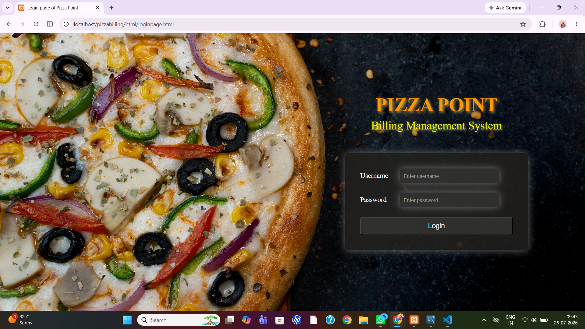
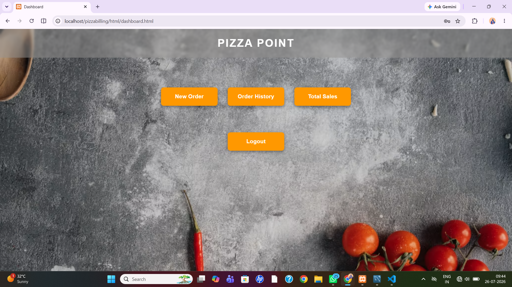
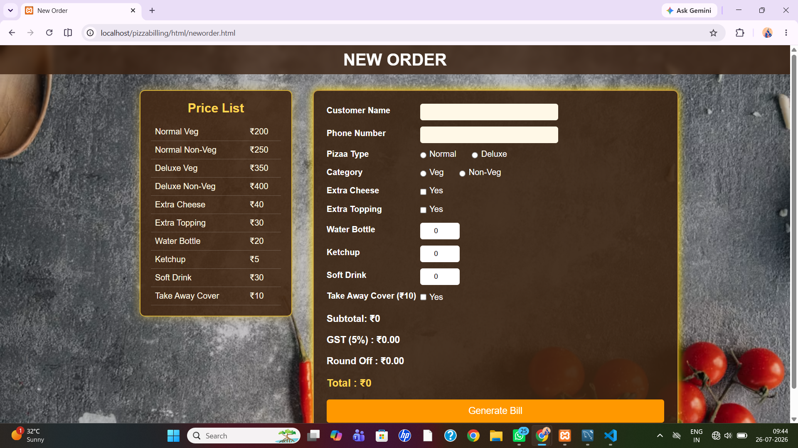
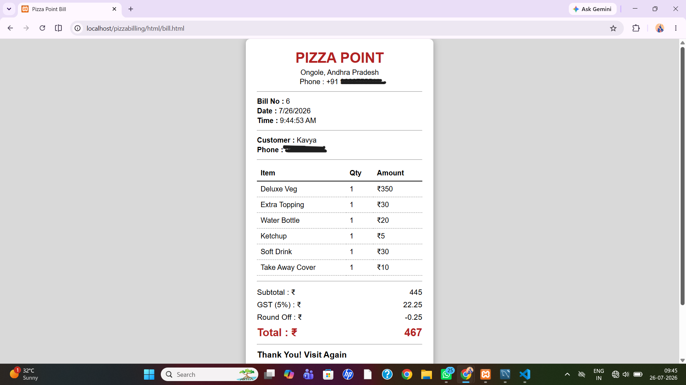
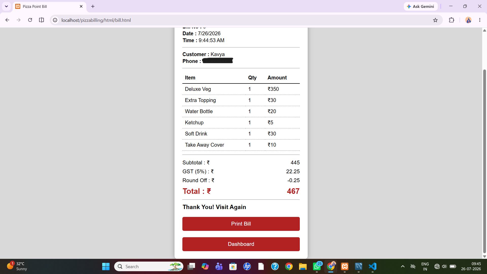
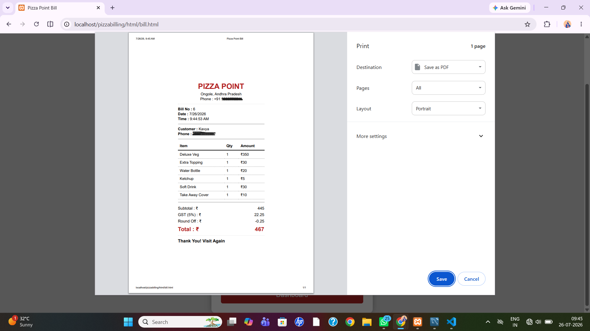
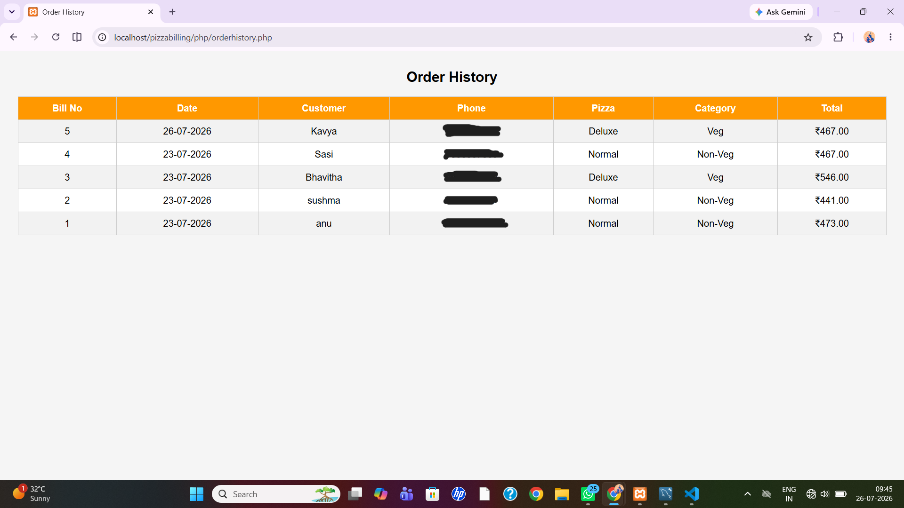
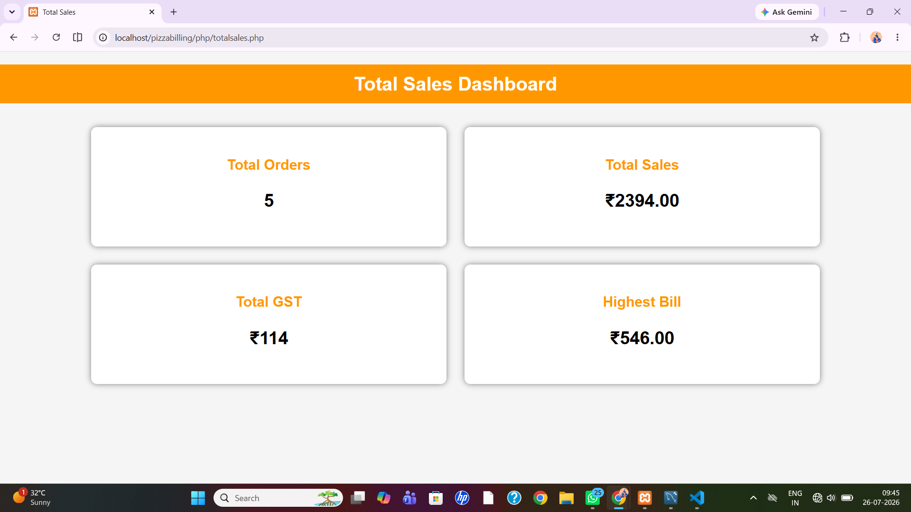

# Pizza Billing System

## Overview

The **Pizza Billing System** is a web-based application developed using **HTML, CSS, JavaScript, PHP, and MySQL**. It simplifies the billing process in a pizza shop by automating bill generation, maintaining order history, and displaying total sales through a user-friendly interface.

---

## ✨ Features

-  Secure Login
-  Dashboard
-  New Order Management
-  Automatic Bill Generation
-  GST Calculation
-  Round-Off Calculation
-  Printable Bill Receipt
-  Order History
-  Total Sales Report
-  MySQL Database Integration

---

## 🛠️ Technologies Used

- HTML5
- CSS3
- JavaScript
- PHP
- MySQL
- XAMPP

---

## 📂 Project Modules

- Login
- Dashboard
- New Order
- Bill Generation
- Order History
- Total Sales
- Logout

---

## 📸 Project Screenshots

### Login Page

### Dashboard

### New Order

### Bill Receipt

### Order History

### Total Sales

---

## 🎥 Project Demonstration

Watch the complete project demonstration here:

**YouTube:** [https://my-youtube-link](https://youtu.be/SywkQBTq2hI?si=AExLdZ5pcTYPevOD)

---

## 🎯 Project Objective

The objective of this project is to automate the billing process in a pizza shop, reduce manual calculations, minimise billing errors, and maintain customer order records efficiently.

---

## 🚀 Future Enhancements

- Multiple pizzas in a single bill
- Online payment integration
- Customer management
- Employee login
- Sales reports with charts
- Inventory management
- Cloud database support

---

## 👩‍💻 Author

**Anuradha**

B.Tech – Computer Science Engineering

---

## 📄 License

This project is developed for educational and learning purposes.
